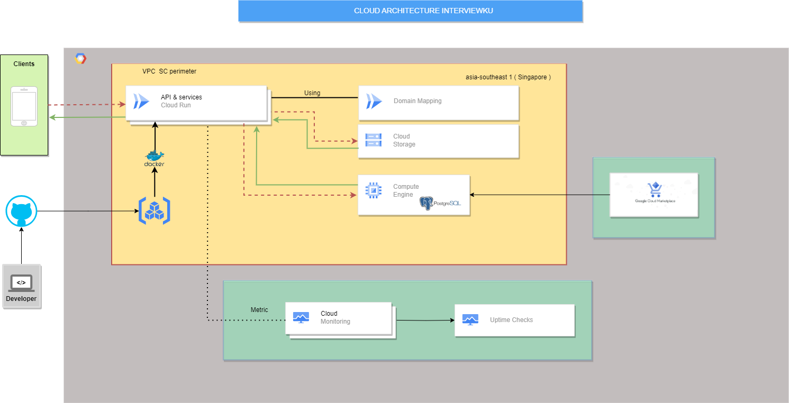

# interviewku-backend

This is the backend for interviewku.com

## Tech Stack

- Node.js
- Hapi.js
- PostgreSQL
- JWT
- Bcrypt
- Swagger
- Jest
- ESLint
- Prettier
- Postman

## How to run

1. Clone this repository by running `git clone https::/github.com/krisna31/interviewku-backend.git` in your terminal
2. Run `cd interviewku-backend` to enter the project directory
3. Run `cp .env.local .env` to copy the environment variables
4. Edit `.env` file to match your environment (e.g. database name, username, password, etc.)
5. Run `npm install` to install all dependencies
6. Run `npm run migrate up` to run the migration (make sure you have PostgreSQL installed and running)
7. Run `npm run dev` to start the server
8. Open `http://localhost:5000` in your browser or API client (e.g. Postman) to explore the API

```bash
  git clone https://github.com/krisna31/interviewku-backend.git
  cd interviewku-backend
  cp .env.local .env
  npm install
  npm run migrate up
  npm run dev
```

## How to run Postman collection

1. Import from file `interviewku-backend/postman/InterviewKu Test.postman_collection.json` to your Postman
2. Import from file `interviewku-backend/postman/InterviewKu Test.postman_environment.json` to your Postman
3. Run the collection
4. Explore Them All!

## How to run Swagger

1. Run `npm run dev` to start the server
2. Open `http://localhost:5000/documentation` in your browser

```bash
  npm run dev
```

## Cloud Architecture


